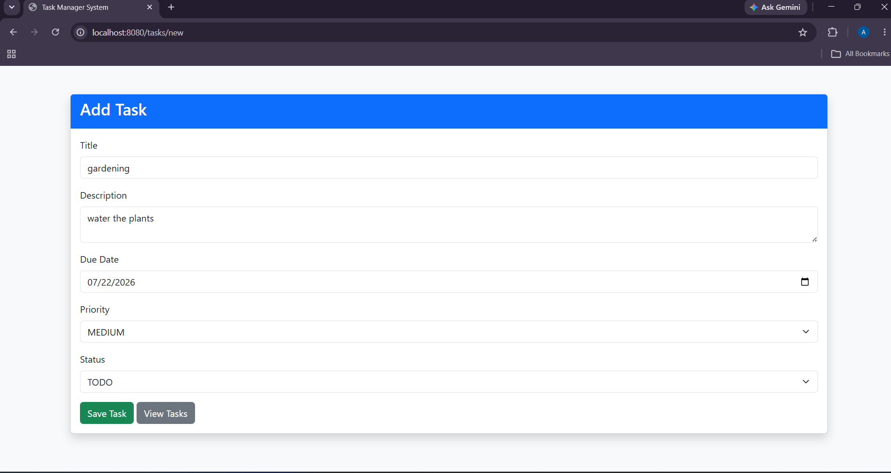
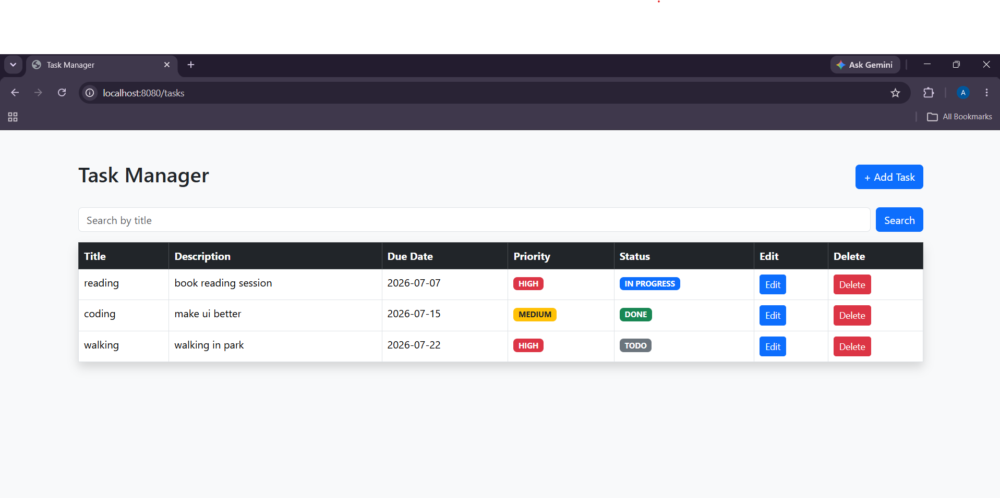
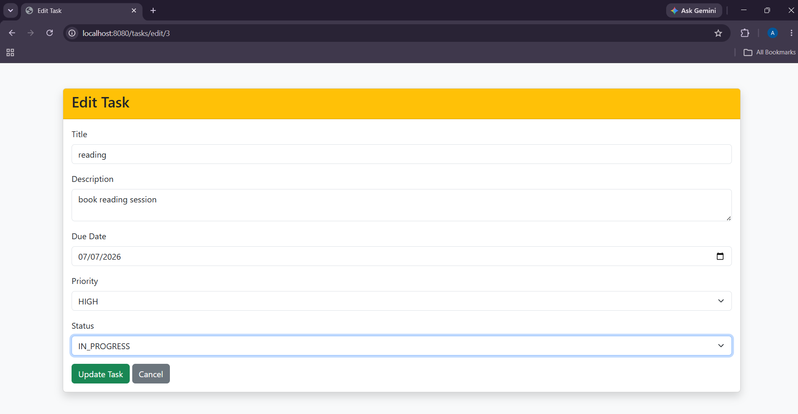
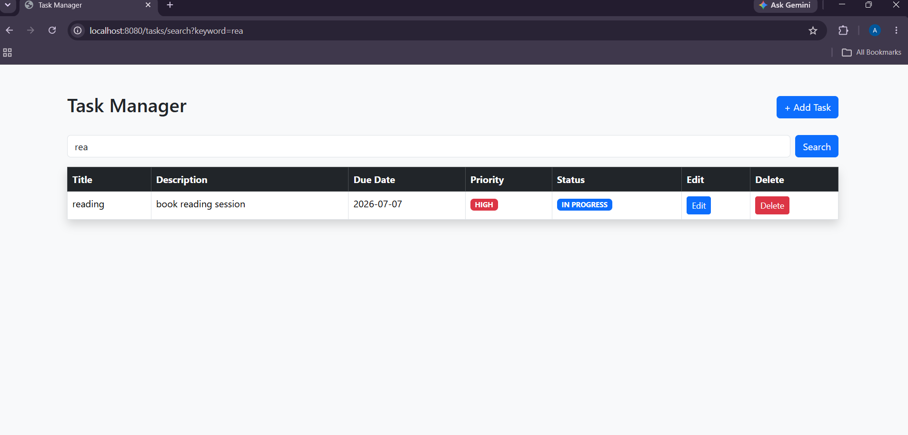
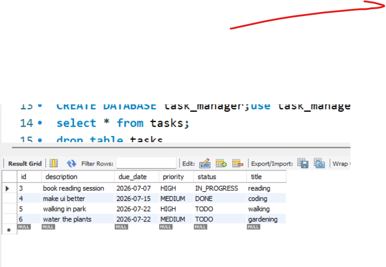

# 📋 Task Management System

A simple and responsive Task Management web application built using **Spring Boot**. This project allows users to create, view, update, and delete tasks while managing their priority, due dates, and status.

---

## 🚀 Features

- ✅ Add new tasks
- 📄 View all tasks
- ✏️ Edit existing tasks
- 🗑️ Delete tasks
- 📅 Manage due dates
- 🚩 Set task priority (Low, Medium, High)
- 📌 Track task status (TODO, IN_PROGRESS, DONE)
- 🎨 Responsive Bootstrap UI
- 💾 MySQL database integration using Spring Data JPA

---

## 🛠️ Tech Stack

- Java 17
- Spring Boot
- Spring Data JPA
- Hibernate
- Thymeleaf
- MySQL
- Bootstrap 5
- Maven

---

## 📂 Project Structure

```
src
├── controller
├── entity
├── repository
├── service
├── templates
├── application.properties
```

---

## 📸 Screenshots

### Add Task



### View Tasks


### Edit Task



### Search Task


### Database


---

## ⚙️ How to Run

1. Clone the repository

```bash
git clone https://github.com/yourusername/Task-Management-System.git
```

2. Create a MySQL database

```sql
CREATE DATABASE task_manager;
```

3. Update `application.properties`

```properties
spring.datasource.url=jdbc:mysql://localhost:3306/task_manager
spring.datasource.username=your_username
spring.datasource.password=your_password
```

4. Run the Spring Boot application.

5. Open:

```
http://localhost:8080/tasks
```

---

## 📖 What I Learned

- Spring Boot MVC Architecture
- Spring Data JPA & Hibernate
- CRUD Operations
- Dependency Injection
- Thymeleaf Template Engine
- Bootstrap UI Design
- MySQL Database Integration

---

## 👩‍💻 Author

**Afifa Syed**
